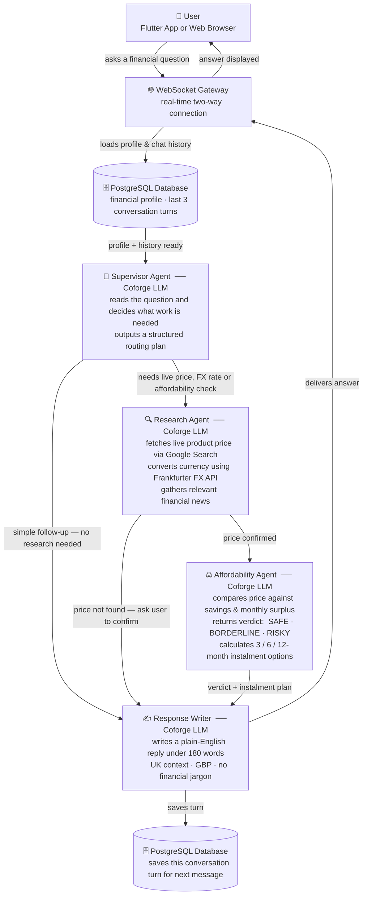

# High-Level Design — AI Financial Assistant

```mermaid
flowchart TD
    USER["👤 User
    Flutter App or Web Browser"]

    GW["🌐 WebSocket Gateway
    real-time two-way connection"]

    DB[("🗄️ PostgreSQL Database
    financial profile · last 3 conversation turns")]

    SUP["🧠 Supervisor Agent  ── Coforge LLM
    reads the question and decides what work is needed
    outputs a structured routing plan"]

    RES["🔍 Research Agent  ── Coforge LLM
    fetches live product price via Google Search
    converts currency using Frankfurter FX API
    gathers relevant financial news"]

    AFF["⚖️ Affordability Agent  ── Coforge LLM
    compares price against savings & monthly surplus
    returns verdict:  SAFE · BORDERLINE · RISKY
    calculates 3 / 6 / 12-month instalment options"]

    SYN["✍️ Response Writer  ── Coforge LLM
    writes a plain-English reply under 180 words
    UK context · GBP · no financial jargon"]

    SAVE[("🗄️ PostgreSQL Database
    saves this conversation turn for next message")]

    USER -->|"asks a financial question"| GW
    GW -->|"loads profile & chat history"| DB
    DB -->|"profile + history ready"| SUP

    SUP -->|"needs live price, FX rate or affordability check"| RES
    SUP -->|"simple follow-up — no research needed"| SYN

    RES -->|"price confirmed"| AFF
    RES -->|"price not found — ask user to confirm"| SYN

    AFF -->|"verdict + instalment plan"| SYN

    SYN -->|"saves turn"| SAVE
    SYN -->|"delivers answer"| GW
    GW -->|"answer displayed"| USER
```
