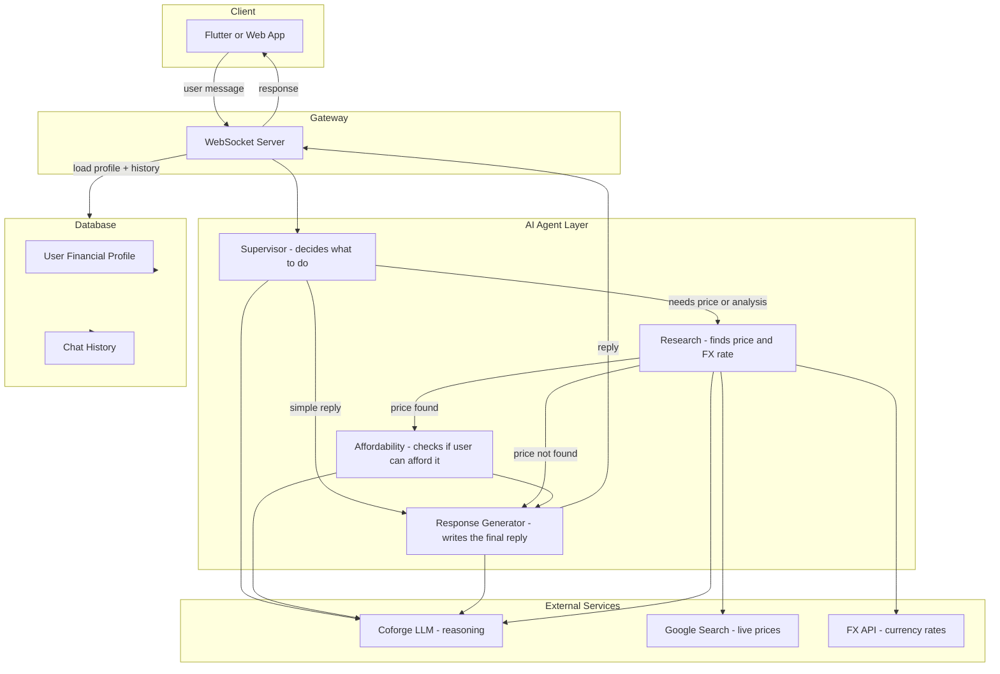

```mermaid
flowchart TD
    subgraph CLIENT[Client]
        FL[Flutter or Web App]
    end

    subgraph GATEWAY[Gateway]
        WS[WebSocket Server]
    end

    subgraph AI[AI Agent Layer]
        SUP[Supervisor - decides what to do]
        RES[Research - finds price and FX rate]
        AFF[Affordability - checks if user can afford it]
        SYN[Response Generator - writes the final reply]
    end

    subgraph EXTERNAL[External Services]
        LLM[Coforge LLM - reasoning]
        SERPER[Google Search - live prices]
        FXAPI[FX API - currency rates]
    end

    subgraph DATA[Database]
        PROFILE[User Financial Profile]
        HISTORY[Chat History]
    end

    FL -->|user message| WS
    WS -->|load profile + history| DATA
    WS --> SUP
    SUP -->|needs price or analysis| RES
    SUP -->|simple reply| SYN
    RES -->|price found| AFF
    RES -->|price not found| SYN
    AFF --> SYN
    SYN -->|reply| WS
    WS -->|response| FL

    SUP --> LLM
    AFF --> LLM
    SYN --> LLM
    RES --> LLM
    RES --> SERPER
    RES --> FXAPI
    DATA --> PROFILE
    DATA --> HISTORY
```
