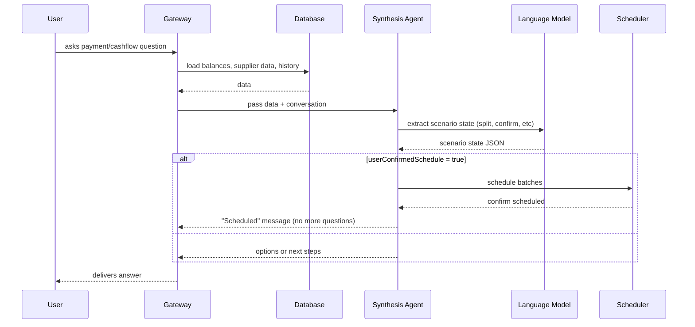

# Low-Level Design — LLM-Driven Confirmation & Scheduling

## Key Logic Components

### 1. Scenario State Extraction (LLM)
- The agent uses a language model to extract scenario state from the full conversation history.
- It detects:
  - If the user wants to split, schedule, or fully release a payment
  - If the user has confirmed scheduling (in any wording)
  - Relevant amounts (split, urgent, deferable)

**Example extracted state:**
```json
{
  "userChoseSplit": true,
  "userConfirmedSchedule": true,
  "lastSplitAmount": 520000,
  "lastDeferAmount": 5080000,
  ...
}
```

### 2. Scheduling Logic
- If `userConfirmedSchedule` is true, the agent:
  - Schedules the payment batches (today + mid-week)
  - Responds with a clear, final message:
    - “The mid-week batch has been scheduled for review. I’ll notify you before release.”
- No further confirmation is requested.
- If confirmation is missing, the agent continues to offer options or ask for next steps.

### 3. Message Flow (Technical)



## Implementation Notes
- No regex or keyword matching for confirmation—LLM intent extraction only
- All amounts and decisions are based on real DB data
- The agent’s response logic is fully state-driven and auditable
