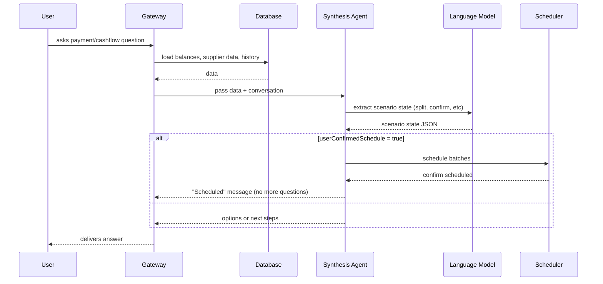

```mermaid
sequenceDiagram
  participant U as User
  participant GW as Gateway
  participant DB as Database
  participant SYN as Synthesis Agent
  participant LLM as Language Model
  participant SCHED as Scheduler

  U->>GW: asks payment/cashflow question
  GW->>DB: load balances, supplier data, history
  DB-->>GW: data
  GW->>SYN: pass data + conversation
  SYN->>LLM: extract scenario state (split, confirm, etc)
  LLM-->>SYN: scenario state JSON
  alt userConfirmedSchedule = true
    SYN->>SCHED: schedule batches
    SCHED-->>SYN: confirm scheduled
    SYN-->>GW: "Scheduled" message (no more questions)
  else
    SYN-->>GW: options or next steps
  end
  GW-->>U: delivers answer
```
