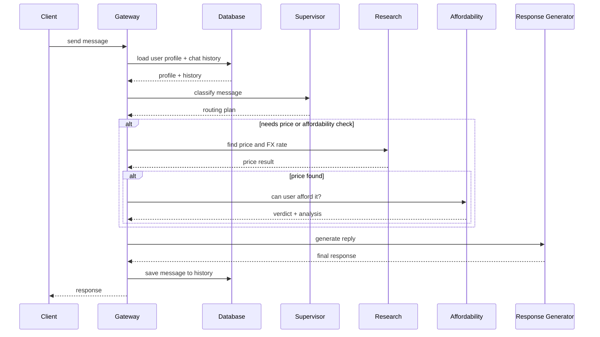

```mermaid
sequenceDiagram
    participant C as Client
    participant WS as Gateway
    participant DB as Database
    participant SUP as Supervisor
    participant RES as Research
    participant AFF as Affordability
    participant SYN as Response Generator

    C->>WS: send message
    WS->>DB: load user profile + chat history
    DB-->>WS: profile + history

    WS->>SUP: classify message
    SUP-->>WS: routing plan

    alt needs price or affordability check
        WS->>RES: find price and FX rate
        RES-->>WS: price result

        alt price found
            WS->>AFF: can user afford it?
            AFF-->>WS: verdict + analysis
        end
    end

    WS->>SYN: generate reply
    SYN-->>WS: final response

    WS->>DB: save message to history
    WS-->>C: response
```
