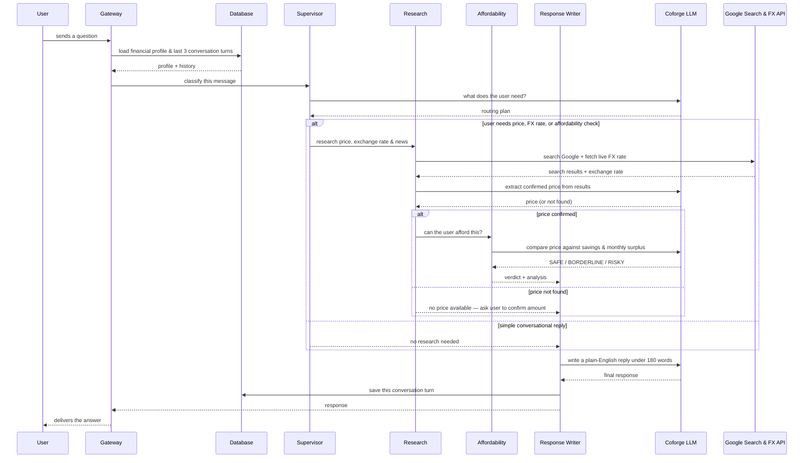

# Low-Level Design — Message Flow

```mermaid
sequenceDiagram
    participant U as User
    participant GW as Gateway
    participant DB as Database
    participant SUP as Supervisor
    participant RES as Research
    participant AFF as Affordability
    participant SYN as Response Writer
    participant LLM as Coforge LLM
    participant EXT as Google Search & FX API

    U->>GW: sends a question
    GW->>DB: load financial profile & last 3 conversation turns
    DB-->>GW: profile + history

    GW->>SUP: classify this message
    SUP->>LLM: what does the user need?
    LLM-->>SUP: routing plan

    alt user needs price, FX rate, or affordability check
        SUP->>RES: research price, exchange rate & news
        RES->>EXT: search Google + fetch live FX rate
        EXT-->>RES: search results + exchange rate
        RES->>LLM: extract confirmed price from results
        LLM-->>RES: price (or not found)

        alt price confirmed
            RES->>AFF: can the user afford this?
            AFF->>LLM: compare price against savings & monthly surplus
            LLM-->>AFF: SAFE / BORDERLINE / RISKY
            AFF-->>SYN: verdict + analysis
        else price not found
            RES-->>SYN: no price available — ask user to confirm amount
        end

    else simple conversational reply
        SUP-->>SYN: no research needed
    end

    SYN->>LLM: write a plain-English reply under 180 words
    LLM-->>SYN: final response

    SYN->>DB: save this conversation turn
    SYN-->>GW: response
    GW-->>U: delivers the answer
```
