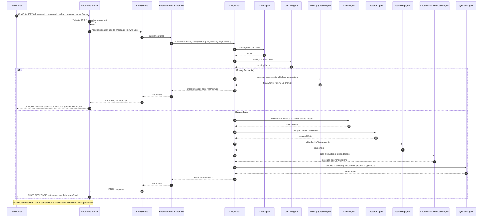

# Socket -> LangGraph -> Socket Sequence

```mermaid
sequenceDiagram
    autonumber
    participant Flutter as Flutter App
    participant WS as WebSocket Server
    participant Chat as ChatService
    participant FAS as FinancialAssistantService
    participant Graph as LangGraph
    participant IA as intentAgent
    participant PA as plannerAgent
    participant FUA as followUpQuestionAgent
    participant FA as financeAgent
    participant RA as researchAgent
    participant REA as reasoningAgent
    participant PRA as productRecommendationAgent
    participant SA as synthesisAgent

    Flutter->>WS: CHAT_QUERY (v1, requestId, sessionId, payload.message, knownFacts)
    WS->>WS: Validate DTO / normalize legacy text
    WS->>Chat: handleMessage({ userId, message, knownFacts })
    Chat->>FAS: run(initialState)
    FAS->>Graph: invoke(initialState, configurable: { llm, vectorQueryService })

    Graph->>IA: classify financial intent
    IA-->>Graph: intent
    Graph->>PA: identify required facts
    PA-->>Graph: missingFacts

    alt Missing facts exist
        Graph->>FUA: generate conversational follow-up question
        FUA-->>Graph: finalAnswer (follow-up prompt)
        Graph-->>FAS: state{ missingFacts, finalAnswer }
        FAS-->>Chat: resultState
        Chat-->>WS: FOLLOW_UP response
        WS-->>Flutter: CHAT_RESPONSE status=success data.type=FOLLOW_UP
    else Enough facts
        Graph->>FA: retrieve user finance context + extract facets
        FA-->>Graph: financeData
        Graph->>RA: build plan + cost breakdown
        RA-->>Graph: researchData
        Graph->>REA: affordability/risk reasoning
        REA-->>Graph: reasoning
        Graph->>PRA: build product recommendations
        PRA-->>Graph: productRecommendations
        Graph->>SA: synthesize advisory response + product suggestions
        SA-->>Graph: finalAnswer
        Graph-->>FAS: state{ finalAnswer }
        FAS-->>Chat: resultState
        Chat-->>WS: FINAL response
        WS-->>Flutter: CHAT_RESPONSE status=success data.type=FINAL
    end

    Note over WS,Flutter: On validation/internal failure, server returns status=error with code/message/retriable
```
